````md
# Quantium Data Analytics Job Simulation — Forage

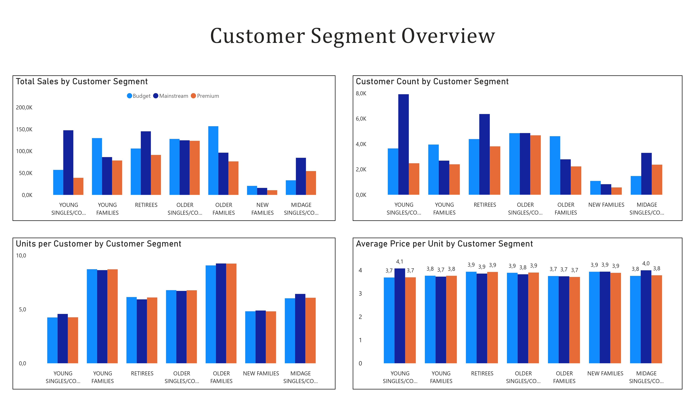

## Project Overview

This repository contains my completed work for the Quantium Data Analytics Virtual Experience Program hosted by Forage.

The project focuses on:
- Customer segmentation analysis
- Retail transaction analytics
- Trial store experimentation
- Commercial recommendations using data-driven insights

---

## Tools & Technologies

- Power BI
- Power Query
- DAX
- PowerPoint

---

## Project Completion

- Completed: May 2026

📄 **Certificate:**  
[View Certificate](./assets/certificate/quantium_data_analytics_certificate_elchin_murshudlu.pdf)

---

# Project Tasks

---

## Task 1 — Customer Analytics & Data Preparation

### Objectives
- Clean and transform transaction datasets
- Analyze purchasing behavior
- Identify high-value customer segments

### Key Insights
- Budget Older Families generated the highest revenue ($156.9K)
- Mainstream Young Singles/Couples generated $147.6K
- Kettle was the top-performing brand ($390K)
- 175g was the most purchased pack size

### Dashboard Preview

| Customer Segmentation | Sales Analysis |
|---|---|
|  | 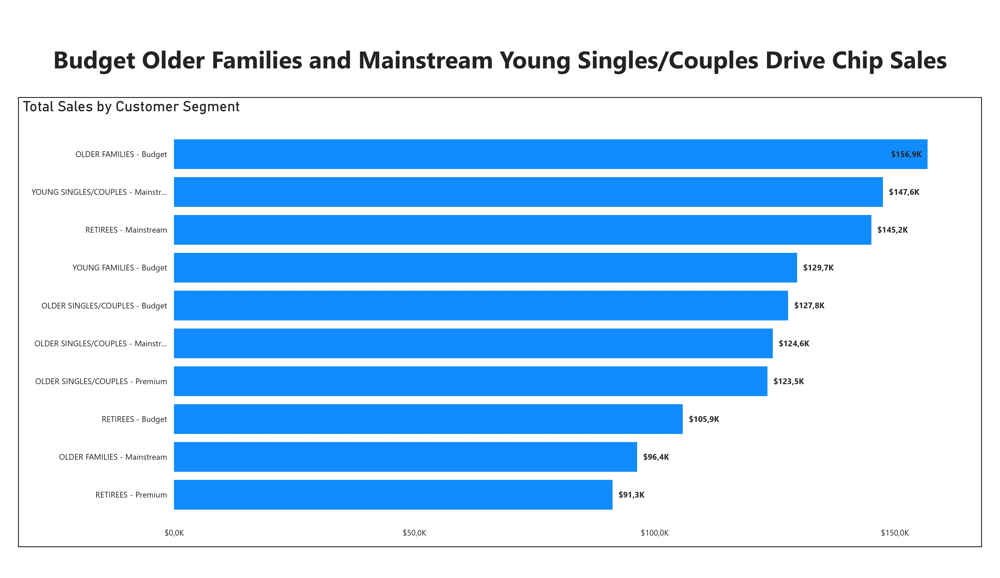 |

| Brand & Pack Size Analysis |
|---|
| 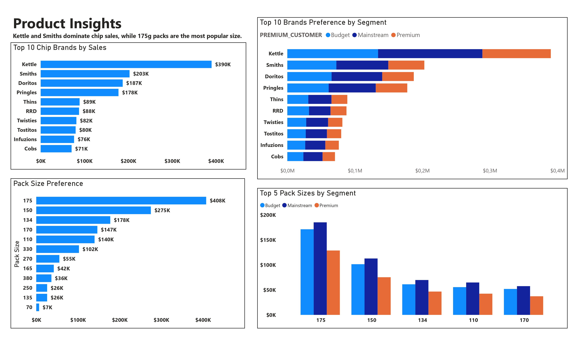 |

📄 [View Task 1 Report](./reports/task-1-customer-analytics/quantium_data_analytics_task1_elchin_murshudlu.pdf)

---

## Task 2 — Trial Store Experimentation

### Objectives
- Select statistically comparable control stores
- Measure trial uplift performance
- Compare pre-trial and post-trial periods

### Trial vs Control Stores

| Trial Store | Control Store |
|---|---|
| 77 | 53 |
| 86 | 73 |
| 88 | 65 |

### Key Findings
- Trial Store 88 delivered the strongest uplift performance
- Significant improvement observed during Feb–Apr 2019

### Dashboard Preview

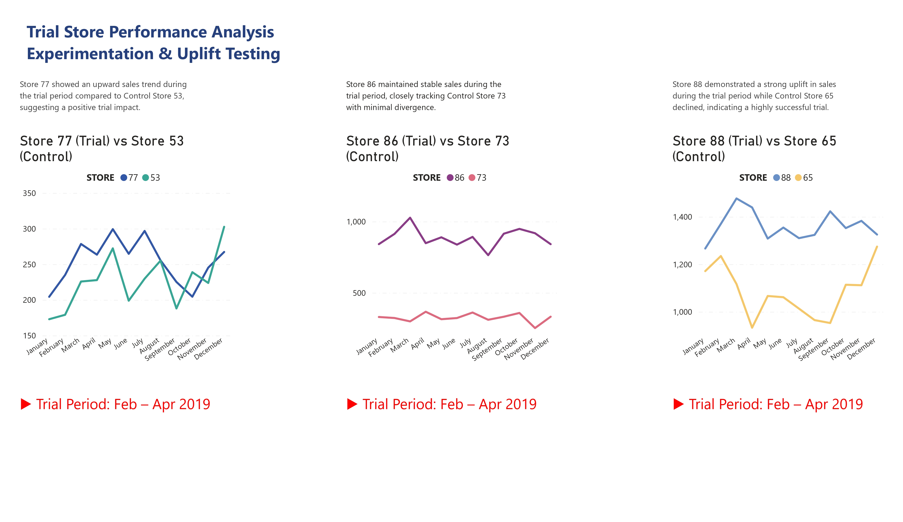

📄 [View Task 2 Report](./reports/task-2-trial-store-analysis/quantium_data_analytics_task2_elchin_murshudlu.pdf)

---

## Task 3 — Commercial Insights Report

### Objectives
- Present business recommendations
- Translate analytics into commercial actions
- Apply Pyramid Principles framework

### Recommendations
1. Target Budget Older Families and Young Singles/Couples
2. Prioritize Kettle and Smiths product lines
3. Expand the new layout strategy from Trial Store 88

### Report Preview

| Report Page 1 | Report Page 2 |
|---|---|
| 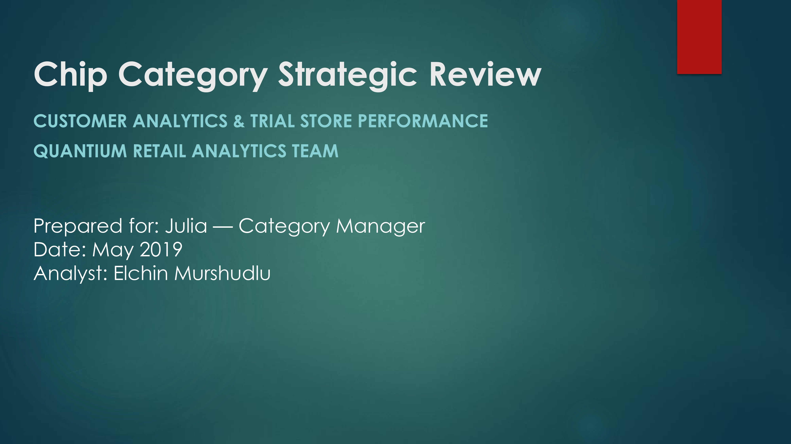 | 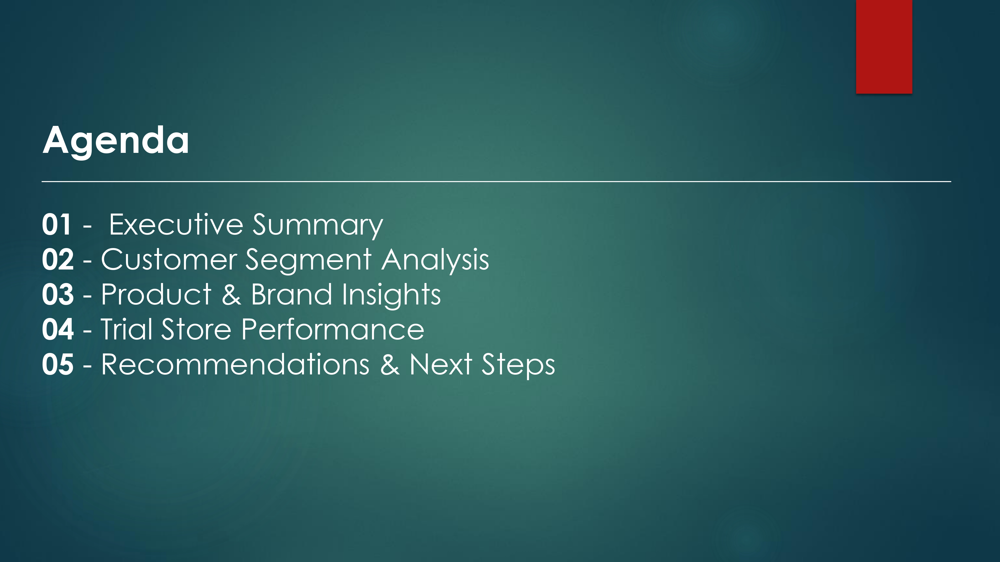 |

| Report Page 3 | Report Page 4 |
|---|---|
| 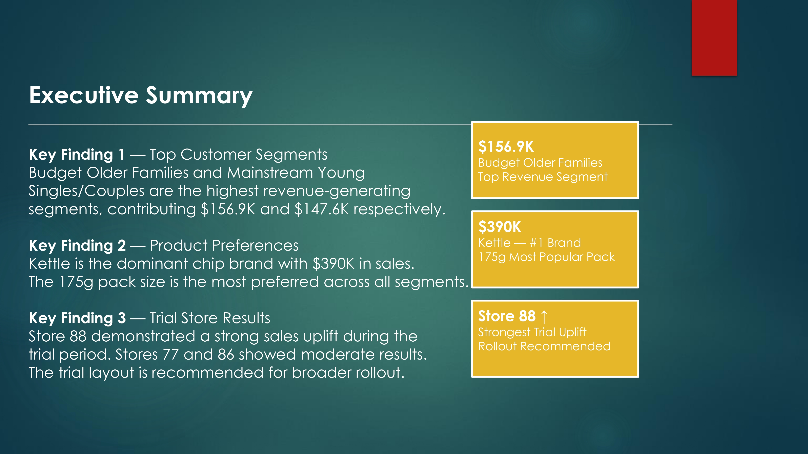 | 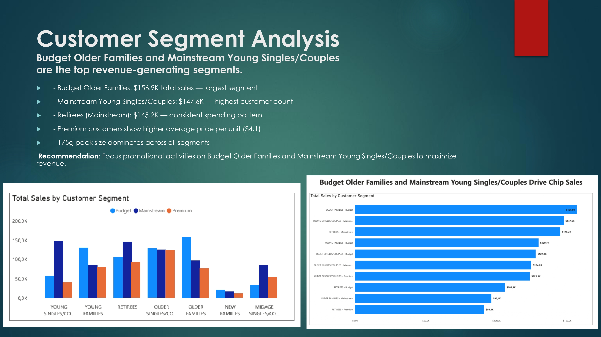 |

| Report Page 5 | Report Page 6 |
|---|---|
| 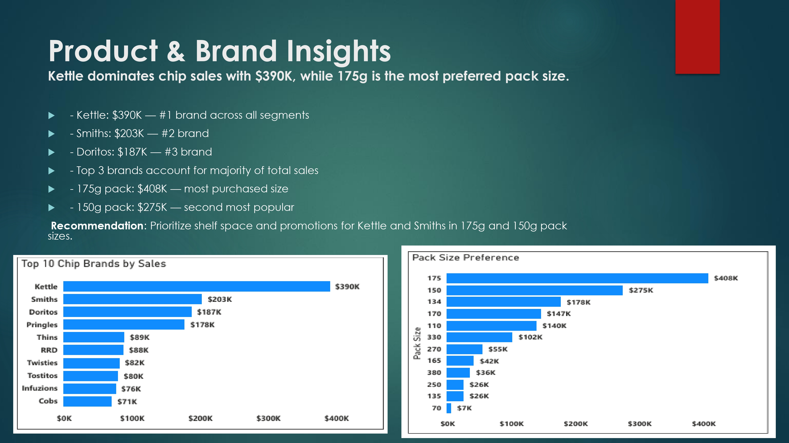 | 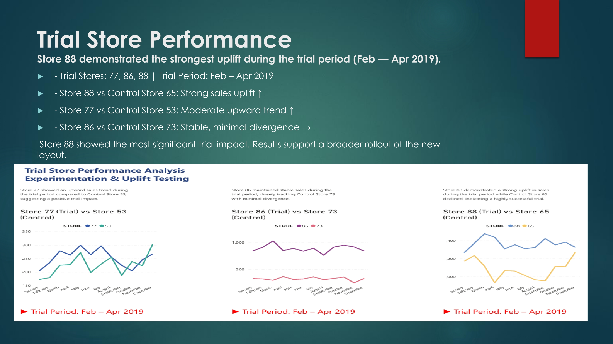 |

| Report Page 7 |
|---|
| 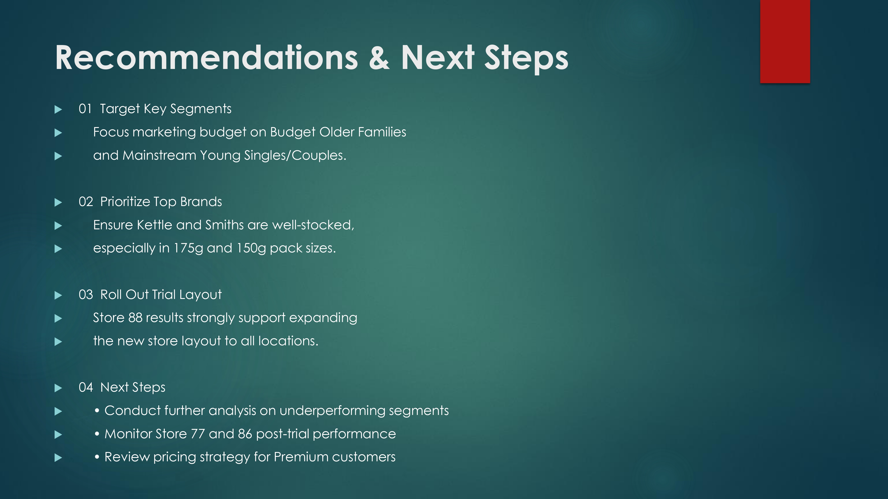 |

📄 [View Task 3 Report](./reports/task-3-commercial/quantium_data_analytics_task3_elchin_murshudlu.pdf)

📊 [View Presentation](./reports/task-3-commercial/quantium-commercial-report-presentation.pptx)

---

# Repository Structure

```bash
Quantium-Data-Analytics-Forage/
│
├── README.md
│
├── assets/
│   └── certificate/
│       └── quantium_data_analytics_certificate_elchin_murshudlu.pdf
│
├── images/
│   ├── quantium_data_analytics_task1_elchin_murshudlu_page-0001.jpg
│   ├── quantium_data_analytics_task1_elchin_murshudlu_page-0002.jpg
│   ├── quantium_data_analytics_task1_elchin_murshudlu_page-0003.jpg
│   ├── quantium_data_analytics_task2_elchin_murshudlu_page-0001.jpg
│   ├── quantium_data_analytics_task3_elchin_murshudlu_page-0001.jpg
│   ├── quantium_data_analytics_task3_elchin_murshudlu_page-0002.jpg
│   ├── quantium_data_analytics_task3_elchin_murshudlu_page-0003.jpg
│   ├── quantium_data_analytics_task3_elchin_murshudlu_page-0004.jpg
│   ├── quantium_data_analytics_task3_elchin_murshudlu_page-0005.jpg
│   ├── quantium_data_analytics_task3_elchin_murshudlu_page-0006.jpg
│   └── quantium_data_analytics_task3_elchin_murshudlu_page-0007.jpg
│
├── reports/
│   ├── task-1-customer-analytics/
│   │   └── quantium_data_analytics_task1_elchin_murshudlu.pdf
│   │
│   ├── task-2-trial-store-analysis/
│   │   └── quantium_data_analytics_task2_elchin_murshudlu.pdf
│   │
│   └── task-3-commercial/
│       ├── quantium-commercial-report-presentation.pptx
│       └── quantium_data_analytics_task3_elchin_murshudlu.pdf
````

---

# About the Program

This project was completed as part of the Quantium Data Analytics Virtual Experience Program provided by Forage.

```
```
